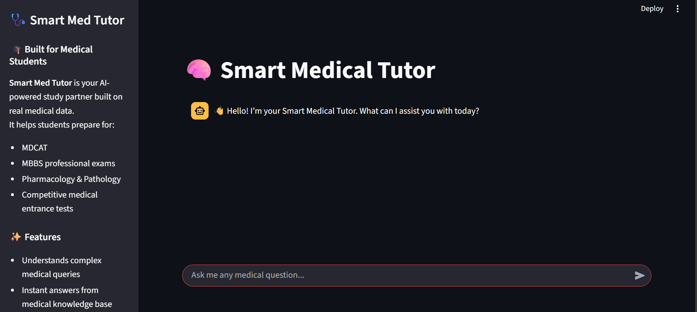
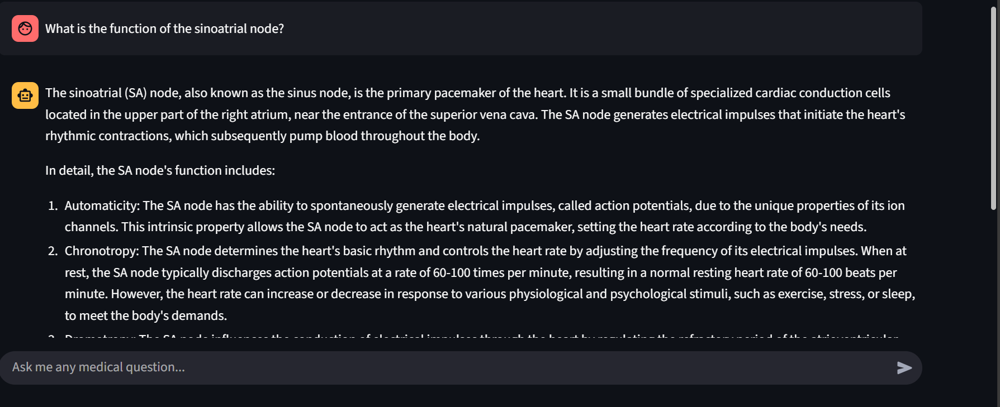
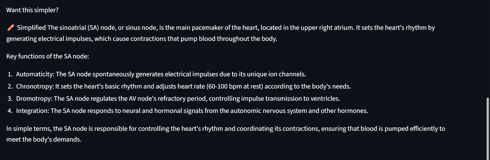
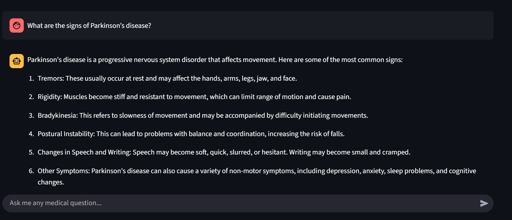
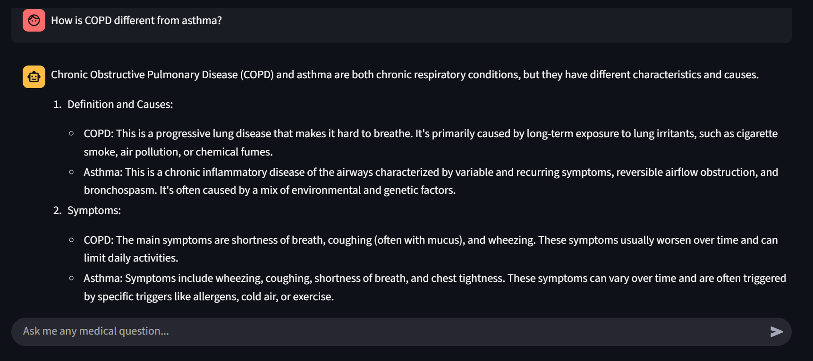
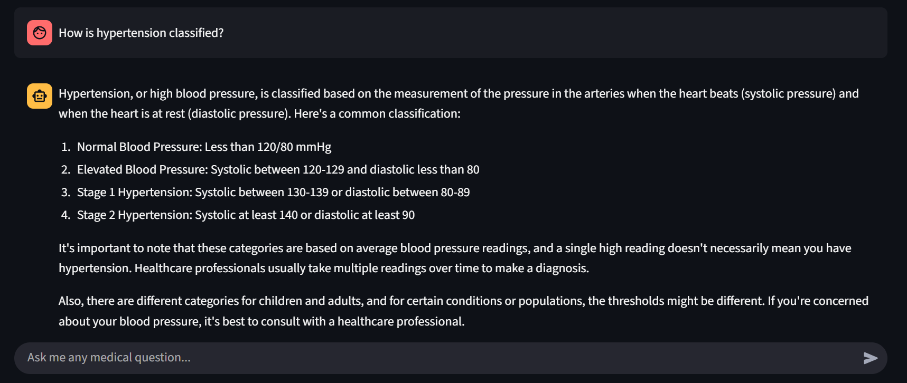
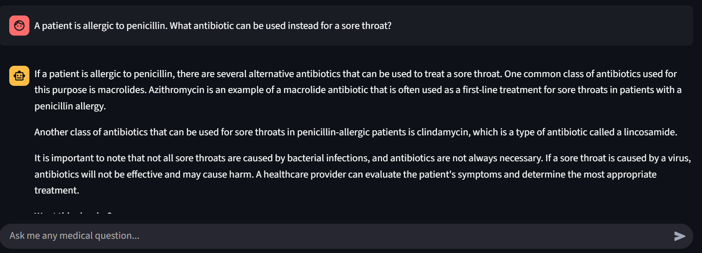
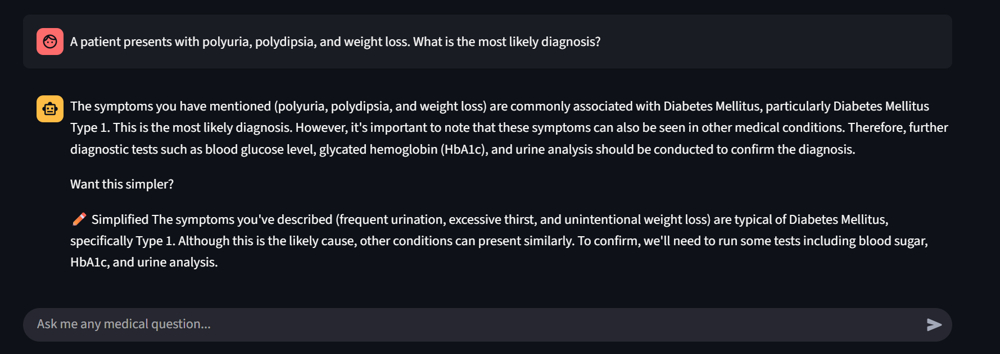

# 🧠 Smart Med Tutor – AI-Powered Medical Learning Assistant

**Smart Med Tutor** is an intelligent AI-powered medical assistant built using **LangGraph**. It is designed to support students across a range of biology and medical education levels — from high school to professional programs like **MBBS**, **BDS**, **Pharmacy**, and **MDCAT preparation**.

This assistant combines a **Retrieval-Augmented Generation (RAG)** approach using **ChromaDB embeddings** with natural LLM-based conversation to deliver accurate, simplified, and context-aware responses to complex medical queries.

---

## 🚀 Tech Stack

| Layer              | Technology                                                                 |
|-------------------|-----------------------------------------------------------------------------|
| 🤖 Agent Framework | [LangGraph](https://github.com/langchain-ai/langgraph)                     |
| 🧠 Language Model  | Any LLM via API (Tested with Mistral 7B on OpenRouter)                      |
| 📚 Embedding Store | [ChromaDB](https://www.trychroma.com/) for fast retrieval                  |
| 📄 Dataset         | [MedMCQA](https://github.com/medmcqa/medmcqa) medical question-answer corpus |
| 🎨 UI Framework    | [Streamlit](https://streamlit.io) for interactive frontend                 |
| 📦 Vector Embedding| Sentence Transformers (`all-MiniLM-L6-v2`)                                 |

---

## 🎯 Who Is It For?

Smart Med Tutor is tailored for:

- **📘 High School Students (Grades 9–12)**  
  Strengthen your understanding of biology and related sciences.

- **🩺 Pre-Medical Students (MDCAT, NEET, etc.)**  
  Practice concept-based and clinical MCQs with quick explanations.

- **🧠 MBBS / BDS / Nursing Students**  
  Get support with medical theory, pharmacology, pathology, and case-based reasoning.

- **💊 Pharmacy & Allied Health Students**  
  Ask drug-related, dosage-based, or scenario-based questions and get clear responses.

---

## 📚 What Can You Ask?

Smart Med Tutor can handle a wide range of questions, including but not limited to:

- Conceptual questions (e.g., "How do enzymes work in digestion?")
- Clinical questions (e.g., "A patient with chest pain and sweating, what could it indicate?")
- Drug-related queries (e.g., "What are the uses and side effects of Augmentin?")
- Medical MCQs and reasoning
- Biology theory from class 9th to university-level
- Medical entrance exam practice
- Pharmacology, pathology, anatomy, and physiology topics

---

## 🧠 How It Works

Smart Med Tutor uses intelligent question understanding combined with a medical knowledge base derived from real-world datasets like **MedMCQA**. Responses are generated using advanced AI models for clarity and accuracy.

---

## 🖼️ Sample Questions

  

    
  

  

    
  

  

    
  

  

    
  

  

    
  

  

    
  

  

    
  

  

    
  

---

## 🤝 Collaboration

We believe in supporting students, educators, and developers working in healthcare and edtech. While the frontend app is available for demonstration, the **full working project** including the backend logic, embeddings, and AI agent pipeline is available through collaboration.

If you are:

- An educator or tutor building student tools  
- A developer working on health education apps  
- A researcher working in AI for medical education  

➡️ We'd love to connect and explore how Smart Med Tutor can help your goals.

---

## 📬 Contact

For feedback, collaboration, or partnership opportunities:

- 💼 Email: [syedsaadi427@gmail.com](mailto:syedsaadi427@gmail.com)
- 🌐 GitHub: [@syedsaadali11](https://github.com/syedsaadali11)

---

> *Smart Med Tutor is your companion in mastering medicine, biology, and health sciences — designed for the next generation of healthcare professionals.*
